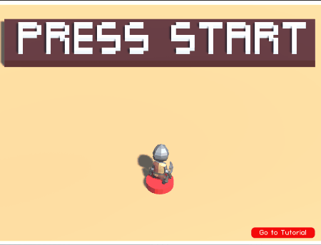
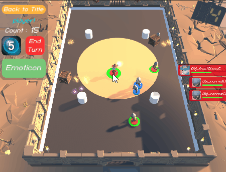
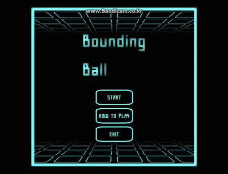

***자세한 내용은 포트폴리오PDF를 확인해주세요.***

  

1-1 캡스톤디자인 모바일게임 프로젝트 [Relic Colldector]
> ## Spin Off

> ## Cubric fighter

> ## Rellic Collector

  
  

1-2 기타 진행 프로젝트
> ## Google VR Kit를 활용한 [매 사냥] 개발

> ## VR API를 활용한 [FloatingCastle] 개발 

> ## 2d픽셀 게임 [BoundingBall] 개발

  
  

2 마이크로컴퓨팅 인턴직 - 12가지 VR 미니게임 제작
> ## 마이크로 컴퓨팅 하계 인턴 [

  
  

3-1 (주)지엘 연구직 - 기존 콘텐츠 리팩토링 진행

3-3 (주)지엘 연구직 - 새로운 인지기능훈련 콘텐츠 기획

3-4, 5 (주)지엘 연구직 - 연구소기업 R&D 우울감 해소, 스트레스 해소 콘텐츠

3-4, 5 (주)지엘 연구직 - 연구소기업 R&D 손동작 콘텐츠 5종

3-4, 5 (주)지엘 연구직 - 연구소기업 R&D 뇌파입력 콘텐츠 4종

